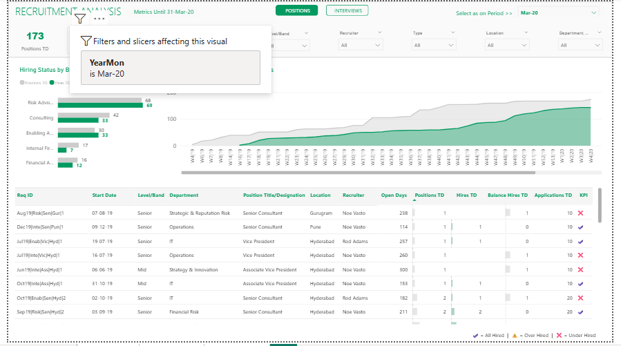
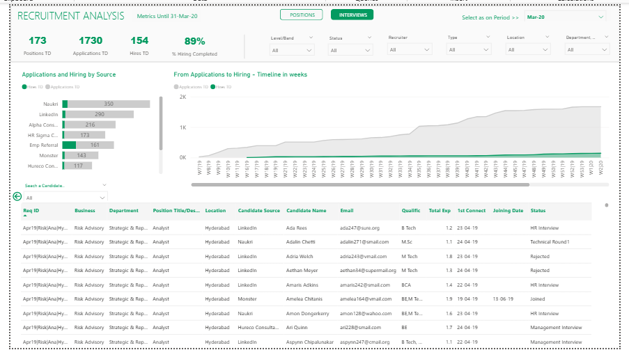

# 📊 Recruitment Analytics Dashboard

## 📝 Short Description
A comprehensive Power BI dashboard designed to optimize recruitment workflows, identify pipeline bottlenecks, and enhance data-driven hiring decisions.

## 🎯 Problem Statement
Organizations often face inefficiencies in their recruitment pipelines, including prolonged time-to-hire, high candidate drop-off rates, and unclear visibility into the hiring funnel. Without proper tracking, recruiters struggle to optimize the candidate journey, leading to lost resources and missed opportunities to hire top talent.

## 🚀 Objectives
* Uncover bottlenecks in the hiring process across different stages.
* Track candidate progression securely through the recruitment pipeline.
* Empower HR and talent acquisition teams with actionable insights to lower drop-off rates and time-to-hire.
* Provide a clear, real-time visualization of job positions and interview status.

## 🛠 Tech Stack
* **Power BI**: For building the interactive dashboard, data modeling, and visualization.
* **Excel / CSV**: Serving as the foundational dataset for candidate and position records.

## 📈 Key KPIs Analyzed
1. **Time-to-Hire**: Average duration from candidate application to final offer acceptance.
2. **Drop-off Rates**: Percentage of candidates who abandon or are rejected at each interview stage.
3. **Funnel Conversion**: Tracking candidate progression from Screening -> Interview -> Offer -> Hired.
4. **Candidate Pipeline**: Active volume of candidates at each open position.

## 💡 Insights & Business Impact
* **Pipeline Optimization**: By isolating stages with the highest drop-off, HR teams can redesign interview workflows and candidate engagement strategies.
* **Resource Allocation**: Highlighting roles with prolonged time-to-hire helps prioritize recruitment efforts and budget allocation.
* **Strategic Growth**: Predicting the timeline to close roles based on historical conversion metrics aligns HR closely with business demands.

## 📸 Dashboard Screenshots

### 1. Positions Overview
Visualizes the aggregate performance and pipeline status of different open roles across the company.


### 2. Interviews Analysis
Deep dives into the interview stages to analyze candidate movement and conversion efficiency.


## ⚙️ How to Use

1. **Clone the Repository**:
   ```bash
   git clone https://github.com/Pratham06-12/recruitment-analytics-dashboard.git
   ```
2. **Explore the Dataset**:
   The raw tabular data is located in the `/data` folder.
3. **Open the Dashboard**:
   Requires [Power BI Desktop](https://powerbi.microsoft.com/desktop/). Open the `.pbix` file from the `/dashboard` directory to interact with the visualizations.
